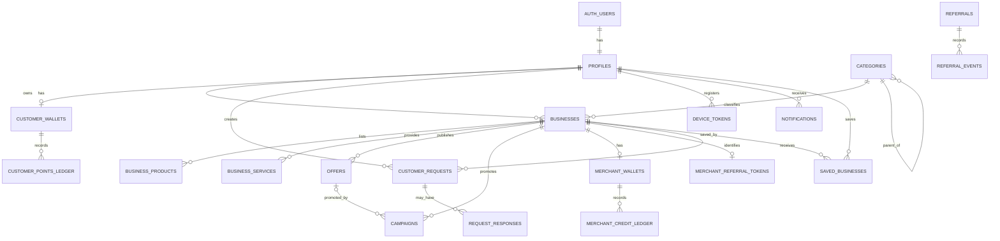

# RDS Nearby — Database & ERD Baseline

Status: Phase 0 schema inventory and target model. This document is planning and documentation only; it does not mutate the live database.

## Principles

- PostgreSQL is the source of truth for ownership, eligibility, state transitions, and rewards.
- Enable RLS on every exposed table and scope policies to the actual ownership model.
- Public discovery is limited to active, verified businesses and valid public inventory/offers.
- Reward balances are backed by ledgers. Correct historical balances with reversal/adjustment entries, not by editing ledger history.
- Client applications must not directly award rewards, spend Marketing Credits, redeem points, or bypass state-transition RPCs.
- Business coordinates are stored; customer location should remain transient unless a separately approved use case requires persistence.
- Never store service credentials in tables, source control, client bundles, or push payloads.

## Existing live table inventory (checked 2026-10-09)

| Domain | Existing tables | Responsibility |
|---|---|---|
| Identity | `profiles` | Auth-linked profile, server-controlled role and status |
| Business discovery | `businesses`, `categories` | Business identity, location, hours, category hierarchy, publication/verification state |
| Catalogue | `business_products`, `business_services`, `offers` | Product/service pricing and availability; time-valid public offers |
| Promotion | `campaigns` | Boost Shop / Promote Offer campaign windows, credit cost and optional offer association |
| Referral | `merchant_referral_tokens`, `referrals`, `referral_events` | Opaque merchant QR identity, attribution lifecycle and event trail |
| Merchant credits | `merchant_wallets`, `merchant_credit_ledger` | Marketing Credits balance and transaction history |
| Customer points | `customer_wallets`, `customer_points_ledger`, `redemptions` | Local Points balance, ledger and merchant-funded redemption records |
| Customer demand | `customer_requests`, `request_responses` | Request lifecycle and business response records |
| Notifications | `notifications`, `notification_preferences`, `device_tokens` | Delivery queue, recipient preferences, registered push tokens |
| Retention | `saved_businesses` | User-saved businesses |
| Operations | `analytics_events`, `audit_logs`, `fraud_flags`, `memberships` | Product events, privileged-action audit, fraud review and membership state |

This is a verified inventory of table names, not a claim that every planned feature is complete. Exact columns, constraints, foreign keys, enum values, grants and policies are defined by the applied migrations and live schema.

## Logical ERD

The ERD is a domain-level map, not a migration. Confirm exact cardinality, nullable references, foreign keys, and delete behaviour from migrations before changing schema.

## Frozen business invariants

### Identity and access
- Roles: customer, merchant, admin; role changes are server-controlled.
- Business owners can manage only their own businesses and catalogue.
- Public users read only eligible discovery records.
- Admin actions use a privileged access path and create audit records.
- Do not authorize using user-editable profile metadata.

### Referrals and rewards
- Lifecycle: PENDING → QUALIFIED, REJECTED, or EXPIRED.
- Qualification requires signup, OTP verification, onboarding completion, and meaningful activity within 48 hours.
- One attribution yields at most one reward.
- Qualified merchant referral: +10 Marketing Credits, with a 2,000 balance cap.
- Customer Local Points and merchant Marketing Credits remain separate.
- 100 Local Points represent ₹10 reward value; redemption is merchant-funded and subject to merchant limits.
- Reward mutations are backend-controlled and idempotent.

### Campaigns
- Boost Shop: 50 Marketing Credits / 24 hours.
- Promote Offer: 100 Marketing Credits / 3 days.
- Spend and campaign creation must be atomic and idempotent.
- Sponsored placement is labelled and cannot displace unrelated organic matches.

### Customer Requests
- Request expiry: 10 minutes; reminders at T+3 and T+8.
- Inbox is the source of truth.
- Push delivery never authorizes data access.
- Resolved/expired requests do not receive reminders.

## Gaps to track

- FCM delivery setup and real-device tests remain outstanding.
- Today's Near You has an initial locality-based RPC and mobile UI. GPS integration, normalized locality data, populated-data acceptance tests, and device-level verification remain outstanding.
- Points redemption, analytics completeness, fraud/security hardening, membership billing and Ask Nearby Shops are later scope.
- Security Advisor has reported authenticated SECURITY DEFINER request RPCs. Review their authorization checks and grants; do not blindly convert them to SECURITY INVOKER.
- Keep GitHub migration files aligned with live migration history and verify each new migration before applying it.
